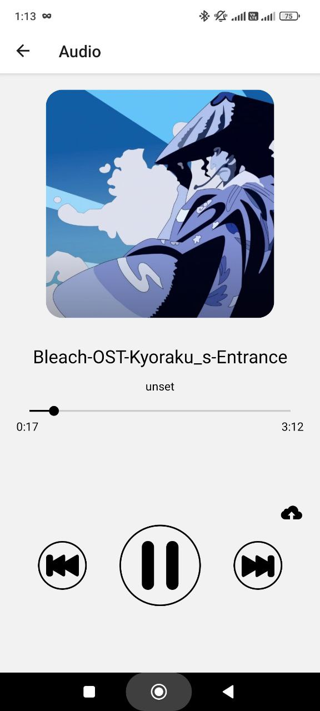
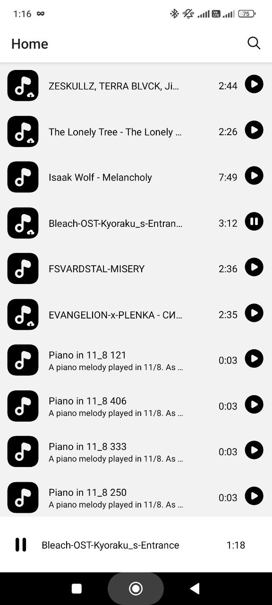
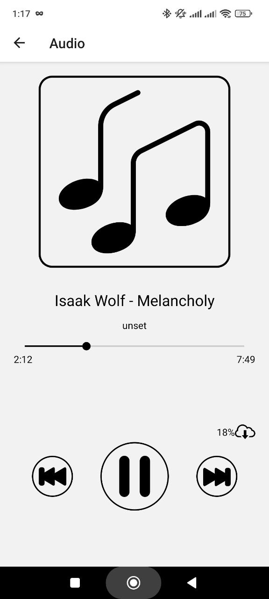

# Demo applications for audio playback
A small application for listening to audio from the Internet and offline made on react-native. It is possible to upload files to the cache. The audio was used to work [react-native-track-player](https://rntp.dev/docs/basics/installation)

<table>
  <tr>
    <td valign="top"></td>
    <td valign="top"></td>
  </tr>
  <tr>
    <td valign="top"></td>
    <td valign="top"></td>
  </tr>
  <tr>
    <td valign="top"></td>
    <td valign="top"> </td>
  </tr>
</table>

## Getting Started
Set the api key in const/env
You can get it on the website freesound.org. Multiple tracks will be added when the app is first launched. Background audio listening works.

You can run it:
```
npm i
npm run ios
```
## is used
- react-native-track-player
- redux-persist
- expo-file-system
- react-redux
- @react-native-community/netinfo

## fix
- add tracks from the cache to the queue with the current playlist update
## Warning
the ios emulator deletes the cache from the audio itself upon completion