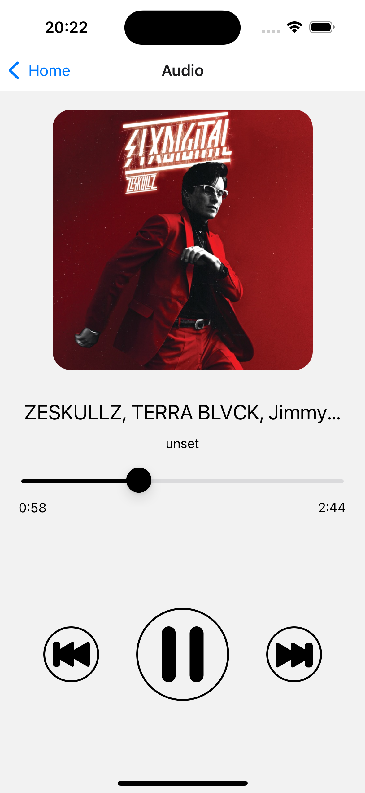
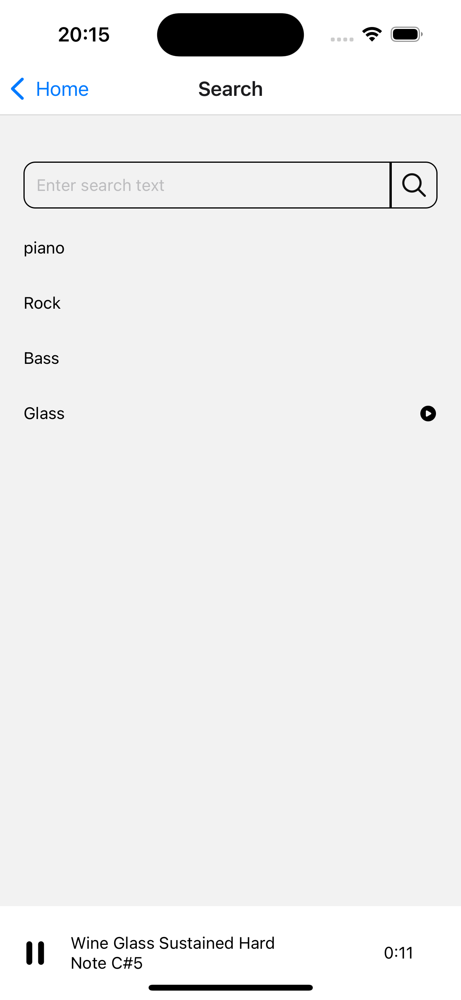
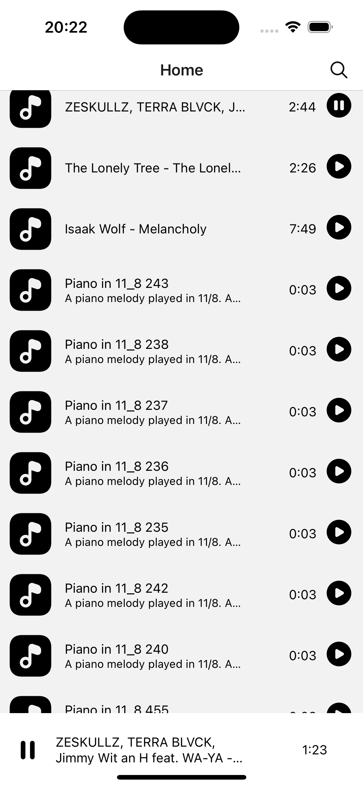

# Demo react-native audio
A small application for listening to audio from the Internet and offline. There is an option to download files to the cache.




## Getting Started
Set the api key in const/env
You can get it on the website freesound.org . Multiple tracks will be added when the app is first launched.
You can run it:
```
npm i
npm run ios
```
## is used
- react-native-track-player
- redux-persist
- expo-file-system
- react-reduxс

## To do
- uploading tracks to a playlist by scrolling the list
- add file cache updates when downloading it

<style type="text/css">
    img {
        width: 250px;
        height: 550px
    }
</style>